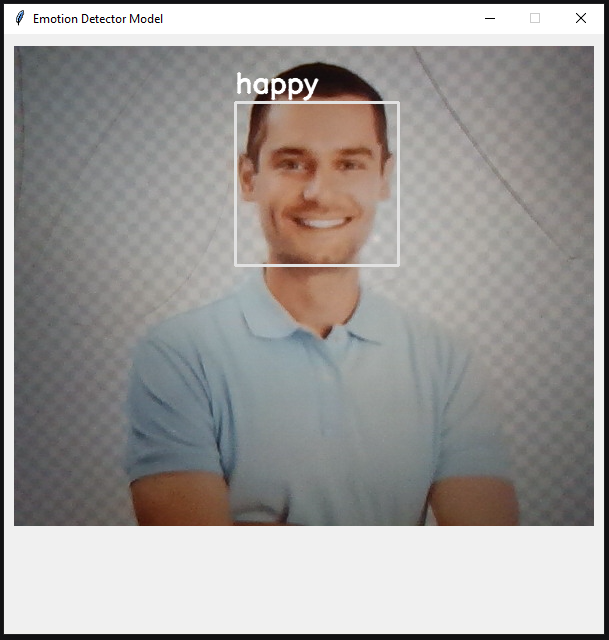

# Emotion Detector

This project is a real-time emotion detection system that identifies three emotions: Angry, Happy, and Neutral. The application uses TensorFlow for the machine learning model, Tkinter for the graphical user interface, and OpenCV for handling video capture and image processing.




## Features

- **Real-time Emotion Detection:** Detects emotions from live video feed.
- **Emotions Supported:** Angry, Happy, Neutral.
- **User-Friendly Interface:** Built with Tkinter
- **Real-Time Feedback:** Displays the detected emotion on the screen. 

## Requirements

To run this project, you need to have the following dependencies installed:

- Python 3.x
- [TensorFlow](https://www.tensorflow.org/) (For the ML model)
- [Numpy](https://numpy.org/) (For array manipulations)
- [Pillow (PIL)](https://python-pillow.org/) (For image processing)
- [Tkinter](https://wiki.python.org/moin/TkInter) (For GUI)
- [Cv2](https://docs.opencv.org/4.x/d6/d00/tutorial_py_root.html) (For capturing video)

## Installation

1. **Clone the Repository:**

   ```bash
   git clone https://github.com/ansariafzal-ka/Emotion-Detection.git
   cd Emotion-Detection

   ```

2. **Install Dependencies:**

   - Create the virtual environment:

     ```bash
     python -m venv venv
     ```

   - Activate the virtual environment:

     ```bash
     ./venv/Scripts/activate
     ```

   - You can install the required dependencies with:

     ```bash
     pip install -r requirements.txt
     ```

3. **Run the Application:**

   To start the application, run the following command in your terminal:

   ```bash
   py main.py
   ```
